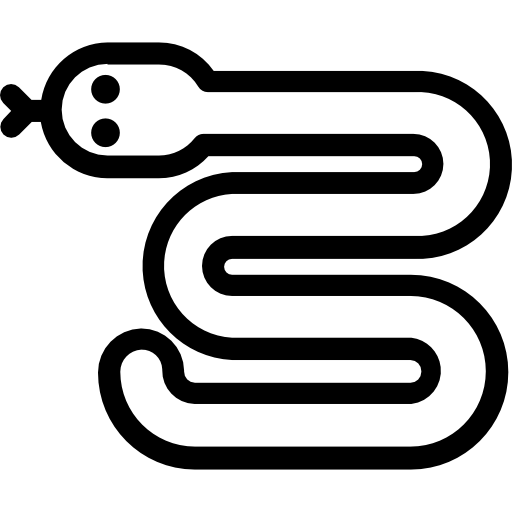

# **Intitulé du projet :** Snake en C (partie 2) 

**Identifiant et libellé universitaire :** SAÉ 1.02 [Nom potentiellement perdu]

**Année :** 2024/2025

**Description succincte du projet :**

Modification d’un jeu snake préexistant, en 3 étapes :
- création d’un déplacement automatique rudimentaire,
- amélioration du déplacement automatique,
- création d’un deuxième serpent

**Cadre :**
Réalisé dans le cadre d’un projet universitaire en binôme.

**Technologies :**
Utilisation de Visual Studio Code et du Terminal. Programmé avec le langage C.

**Résultats :**
Le jeu a été fini avec succès. Il est opérationnel et présentable.

**Aptitudes personnelles développées :**
Créativité, sens du travail en équipe, résolution de problèmes divers.